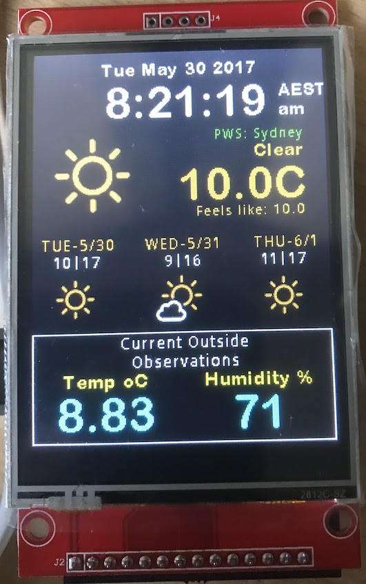
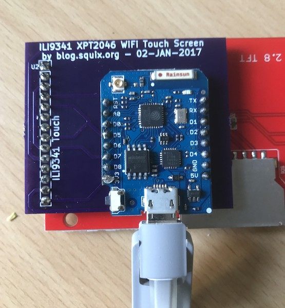

# ESP8266-Color-Weather-Station-v8-TS
Fork of Squix/Fowlerk Weatherstation with Added Thingspeak Channel Display

Important to read full intructions from DK Fowlers Readme 
https://github.com/fowlerk/ESP8266-Color-Weather-Station-v8

This includes functionality to display a single Thingspeak Channel
Full details are in settings.h

Since working on this, fowlerk has updated based code to v11d, will look to integrate my changes to this

PCB design by @squix

